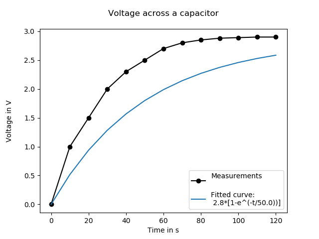

# capacitor_plotting

Python script to plot real data vs. regression data of the voltage across a capacitor.
Despite it´s name it can be also used for regular linear regression and thus for plotting U-I graphs
for resistors.

### Dependencies
1. [python3](https://www.python.org/) & [pip](https://bootstrap.pypa.io/get-pip.py) (check beforehand if it is already installed)
2. [numpy](https://pypi.org/project/numpy/)
3. [matplotlib](https://pypi.org/project/matplotlib/)

### Usage
1. Clone this repository
2. ``python plotting.py <.csv file>`` (standard is: data.csv)

### Specification of .csv input format
Filename: data.csv (can be changes using function_plotting.py <.csv file>)

First line: Title of the graph

Second line: Label for the measurement graph

Third line: Label for the fitted graph

Fourth line: Label for the x-axis

Fifth line: Label for the y-axis 

Sixth Line: Mode (resistor/capacitor)

Seventh line: Range tuple (startvalue, endvalue, step)

Eighth line: Ignored (to seperate the header from the actual data)

Following lines: y values (data) - seperated by commata

There is a sample file called data.csv in the same directory as this script.

### Sample output

### Documentation
The script ``plotting.py`` is well commented. There is a large block comment
at the top mostly providing a mathematical explanation.